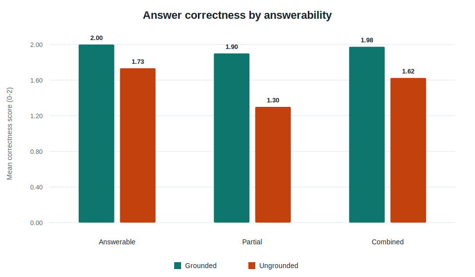
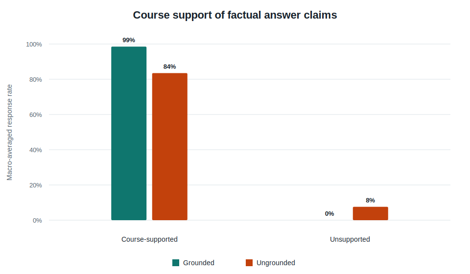
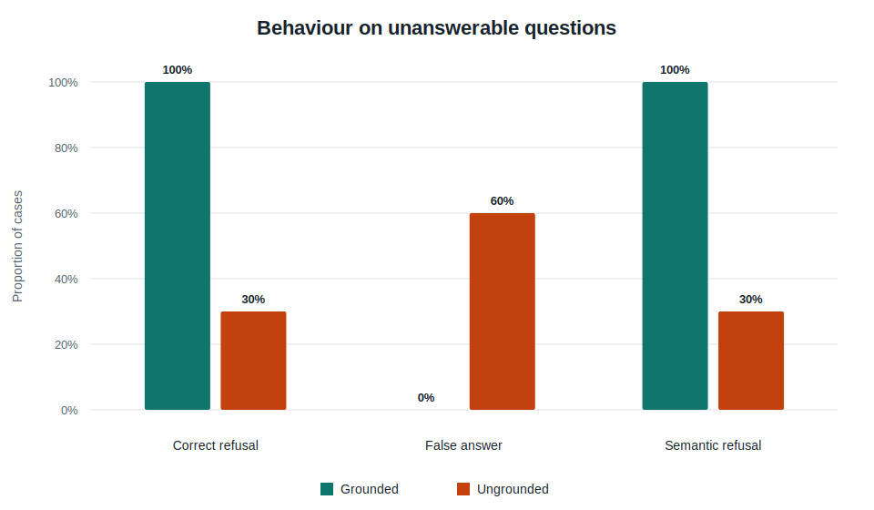

# V1-A Final Grounding Results

This report is generated only from the frozen, author-signed response and claim annotations. Grounded and ungrounded answers are paired by evaluation case.

## Denominators and applicability

Answer correctness and fully correct rates use 40 paired factual cases: 30 answerable and 10 partially answerable. Response-level course-support rates are macro-averages of each factual output's annotated substantive claims; unanswerable refusal outputs are excluded. Partial-answer behaviour uses 10 paired partial cases. Refusal and false-answer rates use 10 paired unanswerable cases. Citation precision and coverage use only the 40 applicable Grounded factual outputs; the Ungrounded condition produced no source citations by design, so its citation metrics are N/A, not zero. Claim-level pooled denominators are reported separately in Table 6.

## Table 1. Overall factual-answer results

| Metric | Grounded, estimate [95% CI] | Ungrounded, estimate [95% CI] | Paired difference [95% CI] | Two-sided p |
| --- | --- | --- | --- | --- |
| Mean answer correctness (0-2) | 1.975 [1.925, 2.000] | 1.625 [1.450, 1.775] | 0.350 [0.200, 0.500] | <0.001 |
| Fully correct rate | 97.5% [87.1, 99.6] | 65.0% [49.5, 77.9] | 32.5 pp [20.0, 47.5] | <0.001 |
| Course-supported claim rate | 98.5% [96.3, 100.0] | 83.5% [73.2, 92.3] | 15.0 pp [7.2, 24.3] | <0.001 |
| Unsupported-by-course claim rate | 0.0% [0.0, 0.0] | 7.6% [2.1, 14.7] | -7.6 pp [-14.6, -2.1] | 0.031 |

Factual results combine 30 answerable and 10 partially answerable cases. Differences are Grounded minus Ungrounded. The response-level course-supported claim rate counts fully supported claims; partial support is reported separately in the claim annotations.

## Table 2. Results by answerability

| Group | Metric | Grounded [95% CI] | Ungrounded [95% CI] | Two-sided p |
| --- | --- | --- | --- | --- |
| Answerable (n=30) | Mean answer correctness (0-2) | 2.000 [2.000, 2.000] | 1.733 [1.567, 1.900] | 0.008 |
| Answerable (n=30) | Fully correct rate | 100.0% [88.6, 100.0] | 73.3% [55.6, 85.8] | 0.008 |
| Answerable (n=30) | Course-supported claim rate | 100.0% [100.0, 100.0] | 95.8% [92.0, 98.9] | 0.062 |
| Answerable (n=30) | Unsupported claim rate | 0.0% [0.0, 0.0] | 1.8% [0.0, 4.7] | 0.500 |
| Answerable (n=30) | False refusal rate | 0.0% [0.0, 11.4] | 0.0% [0.0, 11.4] | 1.000 |
| Partially answerable (n=10) | Mean answer correctness (0-2) | 1.900 [1.700, 2.000] | 1.300 [0.900, 1.700] | 0.031 |
| Partially answerable (n=10) | Fully correct rate | 90.0% [59.6, 98.2] | 40.0% [16.8, 68.7] | 0.062 |
| Partially answerable (n=10) | Course-supported claim rate | 94.2% [85.8, 100.0] | 46.7% [20.0, 73.3] | 0.016 |
| Partially answerable (n=10) | Unsupported claim rate | 0.0% [0.0, 0.0] | 25.0% [5.0, 45.0] | 0.125 |

## Table 3. Partially answerable cases (n=10 paired cases)

| Metric | Grounded [95% CI] | Ungrounded [95% CI] | Two-sided p |
| --- | --- | --- | --- |
| Supported part score | 100.0% [100.0, 100.0] | 65.0% [45.0, 85.0] | 0.031 |
| Supported part fully answered | 100.0% [72.2, 100.0] | 40.0% [16.8, 68.7] | 0.031 |
| Unsupported part limitation score | 80.0% [50.0, 100.0] | 65.0% [35.0, 90.0] | 0.500 |
| Unsupported part fully limited | 80.0% [49.0, 94.3] | 60.0% [31.3, 83.2] | 0.500 |

Partial judgements use 1 for yes, 0.5 for partial, and 0 for no in score metrics. Full rates count only yes.

## Table 4. Unanswerable cases (n=10 paired cases)

| Metric | Grounded [95% CI] | Ungrounded [95% CI] | McNemar exact p |
| --- | --- | --- | --- |
| Correct refusal rate | 100.0% [72.2, 100.0] | 30.0% [10.8, 60.3] | 0.016 |
| False answer rate | 0.0% [0.0, 27.8] | 60.0% [31.3, 83.2] | 0.031 |
| Semantic refusal rate | 100.0% [72.2, 100.0] | 30.0% [10.8, 60.3] | 0.016 |

## Table 5. Grounded citation quality

| Group | Citation precision [95% CI] | Citation coverage [95% CI] |
| --- | --- | --- |
| Answerable (n=30 Grounded outputs) | 97.7% [95.0, 100.0] | 97.8% [93.3, 100.0] |
| Partially answerable (n=10 Grounded outputs) | 84.2% [73.3, 95.0] | 91.7% [80.0, 100.0] |
| Combined (n=40 Grounded outputs) | 94.3% [90.3, 97.6] | 96.2% [91.7, 100.0] |

Citation metrics are Grounded-only. Ungrounded citation values are not applicable and are not encoded as zero.

## Table 6. Claim-level micro analysis

| Mode | Claims | Fully supported | Any support | Unsupported or contradicted |
| --- | --- | --- | --- | --- |
| Grounded | 132 | 98.5% | 100.0% | 0.0% |
| Ungrounded | 121 | 86.8% | 93.4% | 6.6% |

## Qualitative failure analysis

| Case | Affected condition | Finding |
| --- | --- | --- |
| 020 | Ungrounded | Kernel behaviour differed from the reported experiment. |
| 022 | Ungrounded | Used a general covariance convention rather than the course convention. |
| 032 | Ungrounded | Invented a unique K-medians centroid for an even sample. |
| 034 | Both | Overextended breakdown-point evidence into exact outlier counts. |
| 040 | Both | Grounded overclaimed test-set semantics; ungrounded fabricated values. |
| 048 | Neither | Both conditions correctly refused; recovered run provenance retained. |

Full signed-off notes for these cases are exported in `qualitative_failure_cases.csv`.

## Statistical interpretation

Continuous and ordinal paired outcomes use paired sign-flip tests with paired bootstrap 95% confidence intervals. Binary paired outcomes use exact McNemar tests and Wilson intervals for each condition. Bootstrap and Monte Carlo procedures use deterministic seeds. Because partial and unanswerable groups contain only ten cases each, effect sizes and confidence intervals should be emphasised; p-values are exploratory and are not adjusted for multiple comparisons.
